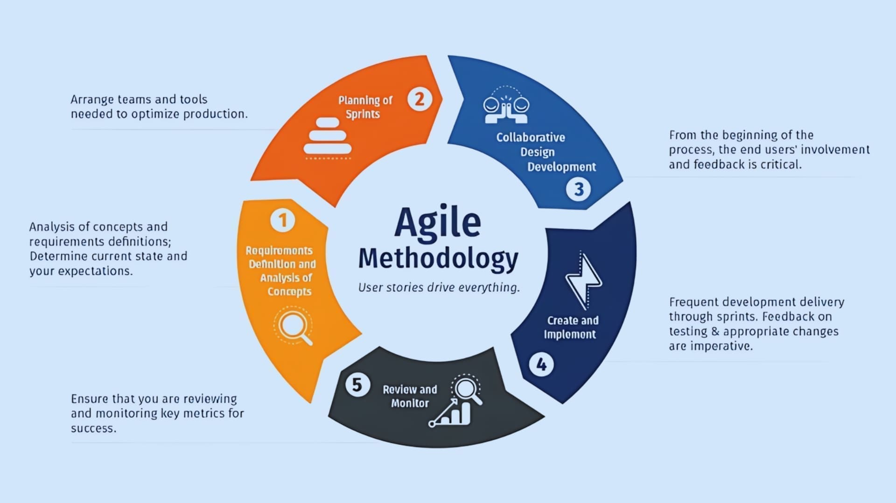

= Approach

Throughout the project, I am following agile principles, which allow for flexibility and adaptability as the project progresses.
This approach enables me to iteratively develop and refine the system based on feedback and testing results, ensuring that the final product meets the desired goals and requirements.

.Agile Workflow
[.figure]

== Test Approach
To ensure a seamless software implementation, I have integrated testing into the project. 
Testing takes different forms, each focusing on different aspects of the project. 
The primary testing methods employed in this project are unit testing and integration testing, which help ensure the quality and functionality of the software.
