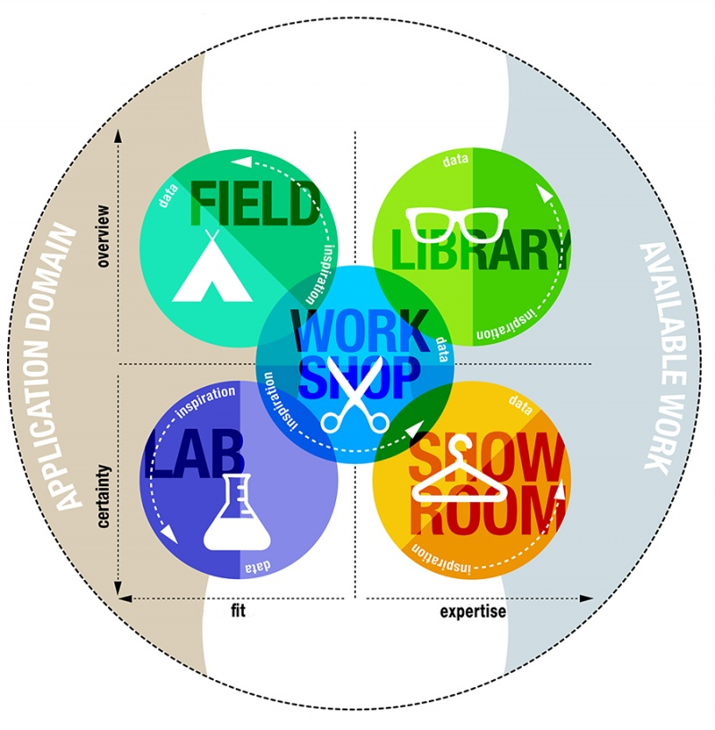

= Research Methods

In this project, the DOT-framework is used as primary research methodology. 
The DOT framework is a systematic approach that focusses on various research strategies to build system.
The research strategies are Field, Lab, Library, Workshop, and Showroom research.

[.figure]
.DOT framework

== Research Methods x Research Questions
Each research question is met with a corresponding research strategy and technique based on the DOT framework. 
This approach ensures that every research question is answered effectively. 

For a comprehensive view of how the DOT framework aligns with our project, consult <<Research Methods and Research Questions>>.

<<<

.Research Methods and Research Questions
|===
| Research Question | Strategy | Technique | Steps 

| Which type of AI is most suitable for monitoring plant health and generating care recommendations? | Literature review & prototyping | Compare AI models (rule-based, ML, neural networks) | 1. Review existing AI approaches for plant monitoring 2. Select candidate models 3. Prototype and evaluate performance 

| Are there existing models that can be used or adapted, or is a custom model needed? | Literature review & evaluation | Analyze pre-trained models | 1. Search for existing plant health datasets and models 2. Evaluate suitability for smart desk setup 3. Decide whether to adapt or build custom model 

| Which sensors and data collection methods provide the most reliable input for real-time monitoring? | Experimentation & prototyping | Sensor testing | 1. Select candidate sensors (soil moisture, light, humidity, etc.) 2. Collect sample data 3. Analyze reliability and accuracy 

| How can the system be implemented effectively in a small embedded setup? | Prototyping & testing | Embedded system development | 1. Design embedded architecture 2. Implement system with selected sensors and AI 3. Test real-time performance 

| How can the system present care recommendations clearly to users? | User-centered design | Mockups & user testing | 1. Design interface mockups 2. Conduct small user tests 3. Collect feedback and iterate 

| Which features improve usability and engagement for desk plant monitoring? | Observation & feedback | User surveys & interviews | 1. Implement prototype with basic features 2. Observe users interacting with system 3. Collect feedback on usability and engagement 

| How can user data be collected, stored, and processed while maintaining privacy and security? | Literature & benchmarking | Review legal/ethical frameworks | 1. Study GDPR and privacy requirements 2. Analyze best practices for IoT data handling 3. Design compliant data handling processes 

| What ethical considerations arise from automating plant care, and how should they influence system design? | Literature & reflection | Ethical assessment | 1. Identify potential ethical concerns (automation, over-reliance) 2. Reflect on implications for design 3. Incorporate safeguards in system design 
|===
