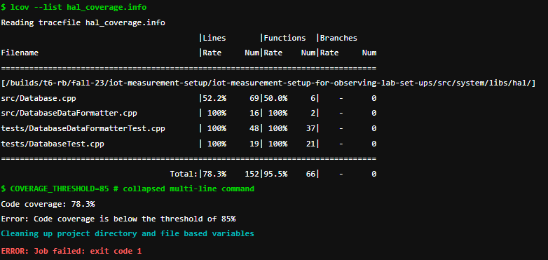

= Gitlab CI/CD Pipeline
Casey Stijlaart <c.stijlaart@student.fontys.nl>
:toc:
:title-page:

:numbered:
:xrefstyle: short

== Overview

The GitLab CI/CD pipeline for your embedded software project is designed to ensure code quality, generate documentation, and perform rigorous testing. 
The pipeline consists of three stages: build, testing, and docs. In the docs stage, documentation is generated, and in the testing stage, various tests, including Google tests and code style checks, are executed.

== Custom Docker Image

To accommodate MongoDB drivers for testing, a custom Docker image (caseystijlaart/iotdatalab-image) is created. This image includes the necessary dependencies and configurations for MongoDB. The image is pulled and used in the testing job.

== Pipeline Configuration File

=== Key Features

==== Documentation Generation

. Documentation is generated for the project plan, system design, and technical document.
. Documentation jobs are triggered manually or when there are changes in relevant documentation files.

==== Google Test Cases

. Google test cases are run on the embedded software.
. Code coverage is checked, and the pipeline fails if coverage falls below the specified threshold of 85%.

==== Code Style Check:

. Code style is checked using cppcheck.

=== Example Output

To showcase how the pipeline works regarding to guarding the software based on coverage, I have disabled multiple tests, to let the coverage get too low, see <<Example Output Pipeline Coverage Failure>>.

[.figure]
.Example Output Pipeline Coverage Failure

== Conclusion

This GitLab CI/CD pipeline ensures comprehensive testing, documentation generation, and code style checks for your embedded software project. 
The modular structure allows for flexibility and easy maintenance, and the pipeline is configured to meet the specific needs of your project. 
Regularly reviewing and updating the pipeline ensures continuous improvement in code quality and development efficiency.