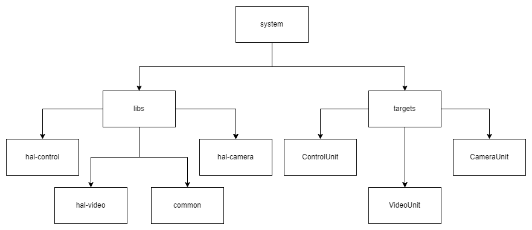

= Project Configuration : Group Project
:toc:
:title-page:
Casey Stijlaart <c.stijlaart@student.fontys.nl>

:numbered:
:xrefstyle: short
:leveloffset: +1

= Introduction

The project configuration is designed to provide a clear organization and promote loose coupling between system components. 
This is achieved through an elaborate folder structure and the use of CMake for streamlined project configuration, building, testing, and packaging.

= System Folder Structure

The project's folder structure consists of two main components: "libs" and "targets."

**targets**

This directory houses all the project's executables.

**libs**

Within this folder, created libraries, along with their source, header, and test files, find their designated spaces.

The hierarchical arrangement is as follows, with an example sub-library:

```
|- system
   |- libs
       |- example
           |- include 
           |- src
           |- tests
   |- targets
```

= CMake

CMake, an open-source, cross-platform toolset, is employed to facilitate project configuration, building, testing, and packaging.

== CMake Project Structure

The project features a general library, "libs," with distinct sub-libraries such as "common," "hal-control," "hal-camera," and "hal-video." Although the code is interconnected, the sub-libraries are designed to function independently, minimizing dependencies and making them easy to add.

To build specific targets without unnecessary dependencies, build flags are employed. 
The main library and sub-libraries allow for modular project development.

[figure]
.System Folder Structure


== CMake Example

To illustrate how the project structure translates into CMake files, the following snippets are extracted from the project.

[source, cmake]
.Targets/CMakeLists.txt : Build Flag Implementation

```
 if(BUILD_COMMON_UNIT)
    add_executable(mqtt_test mqttTest.cpp)

    target_link_libraries(mqtt_test
        PRIVATE
        libs::common
        paho-mqtt3a
        paho-mqttpp3
        nlohmann_json::nlohmann_json
    )
    
    set(TEST_EXECUTABLE_OUTPUT_DIRECTORY ${CMAKE_SOURCE_DIR}/bin)
    set_target_properties(mqtt_test PROPERTIES RUNTIME_OUTPUT_DIRECTORY ${TEST_EXECUTABLE_OUTPUT_DIRECTORY})
    endif()
```

[source, cmake]
.libs/hal-control/CMakeLists.txt : Sub Library Configuration
```
project(hal-control)

find_package(mongocxx REQUIRED)
find_package(nlohmann_json REQUIRED)

add_library(${PROJECT_NAME} INTERFACE)
add_library(libs::hal-control ALIAS ${PROJECT_NAME})

target_include_directories(${PROJECT_NAME}
    INTERFACE
        ${PROJECT_SOURCE_DIR}/include
)

target_sources(${PROJECT_NAME}
    INTERFACE
        ${PROJECT_SOURCE_DIR}/src/Database.cpp
        ${PROJECT_SOURCE_DIR}/src/DatabaseDataFormatter.cpp
        ${PROJECT_SOURCE_DIR}/src/DatabaseManager.cpp
)

add_subdirectory(tests)
```

[source, cmake]
.libs/hal-control/tests/CMakeLists.txt : Google Test and Coverage Implementation

```
project(hal_control_tests)

if(UNIX)
    find_package(GTest REQUIRED)

    include_directories(${PROJECT_SOURCE_DIR}/src/libs/hal-control/include)

    set(CMAKE_CXX_FLAGS "${CMAKE_CXX_FLAGS} -g -O0 --coverage")

    enable_testing()

    add_executable(databaseDataFormatterTest
        ${PROJECT_SOURCE_DIR}/DatabaseDataFormatterTest.cpp
    )

    add_executable(databaseTest
    ${PROJECT_SOURCE_DIR}/DatabaseTest.cpp
    )

    add_executable(databaseManagerTest
        ${PROJECT_SOURCE_DIR}/DatabaseManagerTest.cpp
    )

    target_link_libraries(databaseDataFormatterTest libs::hal-control GTest::GTest GTest::Main gmock mongo::mongocxx_shared)
    target_link_libraries(databaseTest libs::hal-control GTest::GTest GTest::Main gmock mongo::mongocxx_shared)
    target_link_libraries(databaseManagerTest libs::hal-control GTest::GTest GTest::Main gmock mongo::mongocxx_shared)

    add_test(NAME DatabaseDataFormatterTest COMMAND databaseDataFormatterTest)
    add_test(NAME DatabaseTest COMMAND databaseTest)
    add_test(NAME DatabaseManagerTest COMMAND databaseManagerTest)

    find_program(GCOV_PATH gcov)
    find_program(LCOV_PATH lcov)

    if(GCOV_PATH AND LCOV_PATH)
        set(COVERAGE_REPORT_DIR ${CMAKE_SOURCE_DIR}/coverage/hal_control_coverage)
        
        add_custom_target(hal_control_coverage
            COMMAND ${LCOV_PATH} --capture --directory . --output-file ${COVERAGE_REPORT_DIR}/hal_control_coverage.info
            COMMAND ${LCOV_PATH} --remove ${COVERAGE_REPORT_DIR}/hal_control_coverage.info '/usr/*' --output-file ${COVERAGE_REPORT_DIR}/hal_control_coverage.info
            COMMAND ${LCOV_PATH} --list ${COVERAGE_REPORT_DIR}/hal_control_coverage.info
            COMMAND genhtml ${COVERAGE_REPORT_DIR}/hal_control_coverage.info --output-directory ${COVERAGE_REPORT_DIR}/html
        )

        add_dependencies(hal_control_coverage databaseDataFormatterTest databaseTest databaseManagerTest)
    else()
        message(WARNING "gcov/lcov not found. Code coverage analysis will not be available.")
    endif()
endif()
```

== Using Build Flags

To implement build flags, adjust the project build approach. 
For instance, building only the Control Unit involves the following command: 

```
cmake -B build -DBUILD_CONTROL_UNIT=ON
```

Subsequently, the standard build process is executed.

= Conclusion

In summary, the project configuration employs a well-defined system folder structure, fostering organizational clarity and minimizing interdependencies. 
CMake enhances project configurability and simplicity, while build flags facilitate selective target compilation, reducing potential errors. 
This structured approach ensures efficient project development and maintenance.