= Dataset Validation Report
:toc:
:toclevels: 3

== Purpose
This document summarizes the validation work for the four collected datasets and evaluates whether each dataset is suitable for the personal project goals.

The validation focuses on:

* feature availability for the target use case,
* basic data quality checks,
* baseline model behavior,
* compatibility with small models (TinyMLP / TinyRegression), and
* anomaly-detection potential.

== Used Datasets (Sources)

The validation in this report uses the following public datasets:

. Plant Health Diseases Dataset (Kaggle): https://www.kaggle.com/datasets/muqaddasejaz/plant-health-diseases-dataset
. Indoor Plant Health and Growth Dataset (Kaggle): https://www.kaggle.com/datasets/souvikrana17/indoor-plant-health-and-growth-dataset
. Edge Assisted Agricultural Sensor Dataset (Kaggle): https://www.kaggle.com/datasets/colabsss/edge-assisted-agricultural-sensor-dataset
. Plant Health Biosensor Dataset (Kaggle): https://www.kaggle.com/datasets/programmer3/plant-health-biosensor-dataset

== Validation Criteria
Each dataset was reviewed using the same checklist:

* Required fields available (light, soil moisture, humidity, ambient temperature, plant health or equivalent target).
* Missing values and duplicates.
* Data types and label format.
* Class balance / target signal quality.
* Baseline Random Forest test performance.
* TinyMLP / TinyRegression feasibility.

== Executive Summary

[cols="1,1,1,2"]
|===
| Dataset | Baseline Signal | TinyML Readiness | Overall Verdict

| Plant Health Data
| Strong
| Good
| Recommended after feature engineering.

| Indoor Plant Health & Growth Factors
| Weak
| Poor
| Not recommended in current form (weak relationship to target).

| Agriculture Dataset with Target
| Weak-to-moderate
| Limited
| Usable for experiments, not strong for reliable prediction.

| Plant Health Biosensor Dataset
| Moderate
| Promising
| Potentially usable for constrained embedded models.
|===

== Dataset 1: Plant Health Data

=== Findings
* The dataset is one of the most usable options for the project.
* Raw features show imbalance in predictive power (single-feature dominance).
* After feature engineering, model behavior improves significantly and becomes more suitable for compact models.

=== Key Metrics
* Random Forest test accuracy: `0.8250`
* TinyMLP test accuracy: `0.6958`
* TinyRegression: `MSE 0.2850`, `MAE 0.4148`, `R² 0.5388`

=== Proof Images
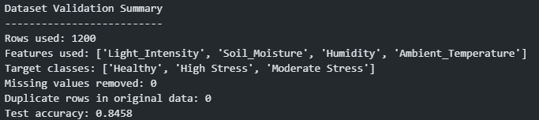
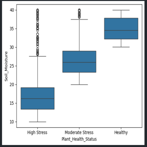
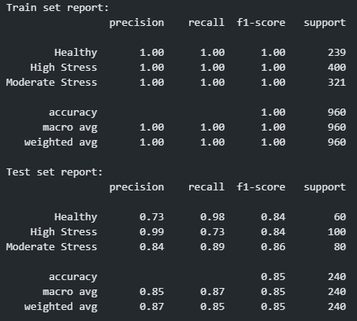

==== Engineered Version
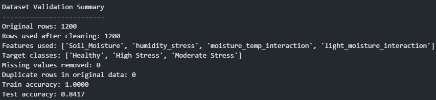
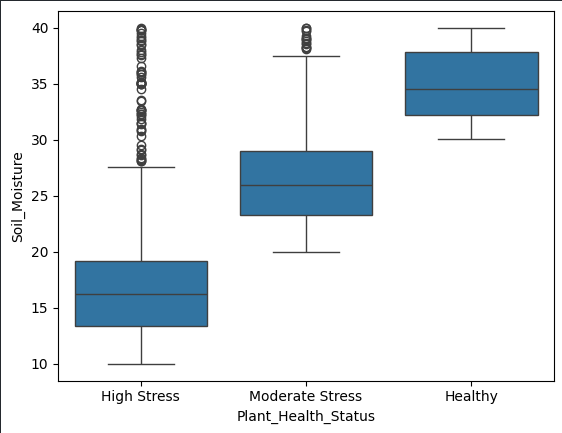
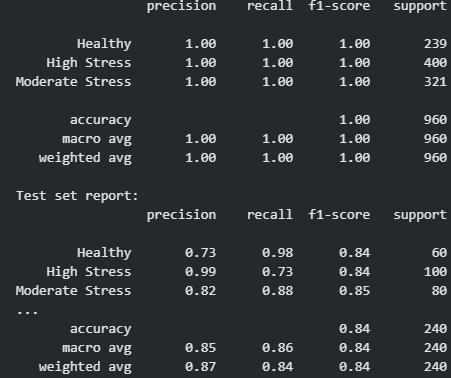

== Dataset 2: Indoor Plant Health and Growth Factors

=== Findings
* Baseline performance is low and unstable.
* Adding `Plant_ID` / plant-specific information produces only marginal improvement.
* Correlation analysis indicates weak relationships between input features and the health target.
* Feature importances are relatively flat, suggesting low signal strength.
* Adding extra columns (for example light exposure, soil type, pest presence) did not improve results and in some runs reduced performance.

=== Key Metrics
* Random Forest test accuracy: `0.2150`
* TinyMLP test accuracy: `0.2050`
* Anomaly detections: `132`

=== Proof Images
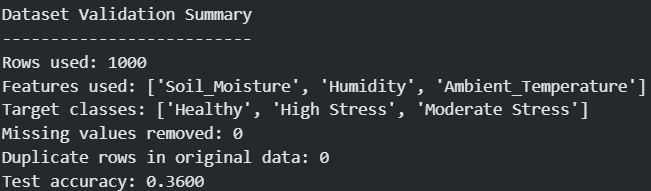
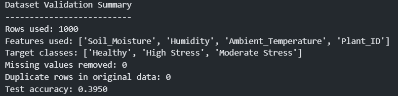
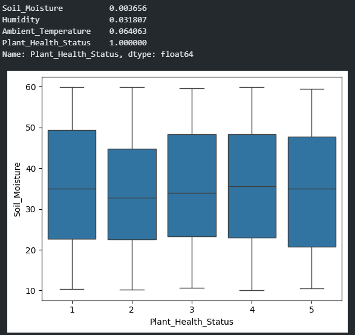
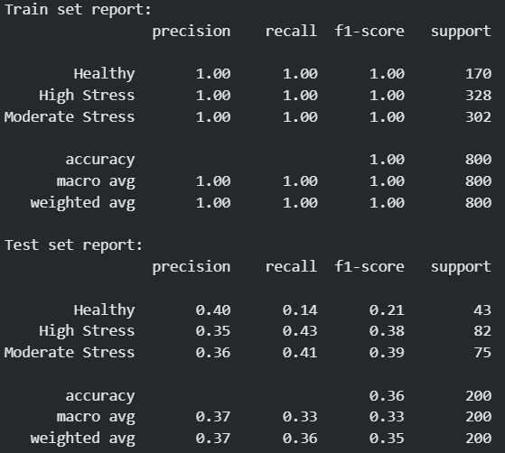
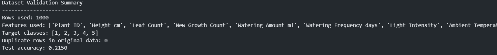

== Dataset 3: Agriculture Dataset with Target

=== Findings
* The dataset can be used for broad experimentation, but predictive strength is limited.
* Baseline classification quality is low, indicating noisy or weakly informative feature-target mapping.
* TinyRegression results also indicate weak explanatory power (`R² < 0`).

=== Key Metrics
* Random Forest test accuracy: `0.3125`
* TinyMLP test accuracy: `0.3650`
* TinyRegression: `MSE 0.7001`, `MAE 0.7157`, `R² -0.0730`
* Anomaly detections: `218`

=== Proof Images
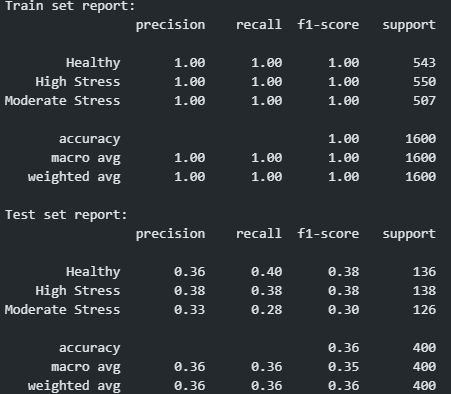
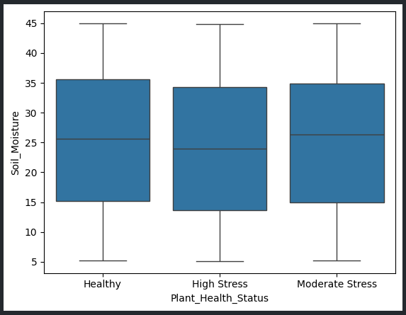
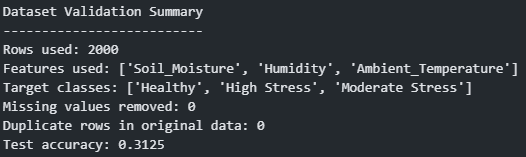

== Dataset 4: Plant Health Biosensor Dataset

=== Findings
* The dataset shows a moderate predictive signal.
* It appears more aligned with sensor-driven use cases and may transfer better to constrained (TinyML-style) deployment than the weaker datasets.
* Requires the same quality checks as the others, but initial behavior is promising.

=== Key Metrics
* Baseline test accuracy (notebook run): `0.6295`

=== Proof Images
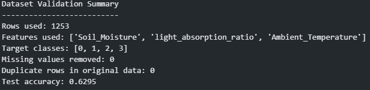
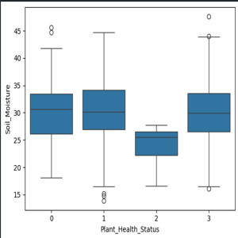
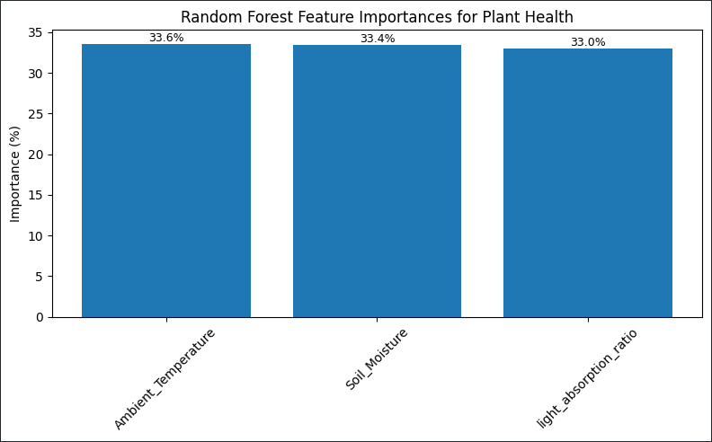

== Final Recommendation

For the project objective (small, practical, and deployable predictive models), prioritize:

. *Plant Health Data (engineered version)* as the primary dataset.
. *Plant Health Biosensor Dataset* as a secondary candidate.

Use *Agriculture* as an exploratory dataset only, and avoid relying on *Indoor Plant Health and Growth Factors* for final model training unless substantial restructuring/label redesign is performed.
